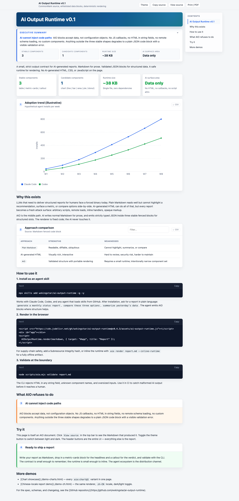
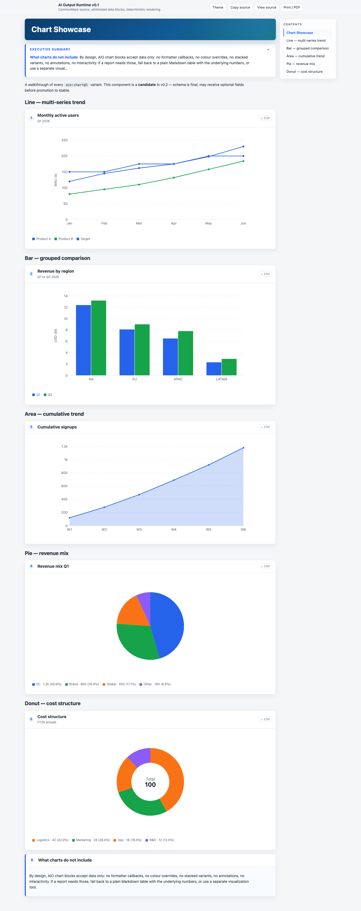

# AI Output Runtime (AIO)

> **AI 报告的「数据契约」。** Markdown 保留为源稿。一份 ~38 KB 的安全 runtime 负责渲染。AI 不写 HTML、CSS、也不写任何 JavaScript。

[](https://github.com/wxkingstar/ai-output-runtime/actions/workflows/ci.yml)
[](https://github.com/wxkingstar/ai-output-runtime/releases/tag/v0.4.3)
[](LICENSE)
[](https://cdn.jsdelivr.net/gh/wxkingstar/ai-output-runtime@v0.4.3/assets/ai-output-runtime.js)
[](https://skills.sh/wxkingstar/ai-output-runtime)

[🇬🇧 English](README.md) · 🇨🇳 **中文** · [🇯🇵 日本語](README.ja.md)

[**在线 demo →**](https://wxkingstar.github.io/ai-output-runtime/)

<p align="center">
  <a href="https://wxkingstar.github.io/ai-output-runtime/">
    
  </a>
</p>

---

## 为什么有这个项目

2026 年 5 月，Anthropic Claude Code 团队成员 Thariq Shihipar 发起了一场讨论：**让 Claude Code 输出 HTML，比 Markdown 更合适**。报告更丰富、视觉更精致、能做真正的 dashboard。他说的没错——HTML 的上限确实更高。

但这场讨论引出了一个绕不开的问题——**HTML 是谁写的？**

如果 **AI 写**，每份报告就是一份攻击面：内联事件、远程加载、不可审查的 markup、人类没法 diff。如果 **人写模板**，又会丢掉 LLM 输出最有价值的那块——动态性。

AIO 是第三条路。**AI 输出数据，runtime 输出 HTML。**

Agent 写 CommonMark Markdown + 四种 schema 校验过的 JSON 块——`table`、`metric-cards`、`callout`、`chart`。Runtime 安全渲染它们。AI 完全没有可控的执行代码面。

讨论原文：

- [Thariq Shihipar — Unreasonable effectiveness of HTML in Claude Code](https://thariqs.github.io/html-effectiveness/)
- [Simon Willison 关于这场讨论的笔记](https://simonwillison.net/2026/May/8/unreasonable-effectiveness-of-html/)
- [r/ClaudeCode Reddit 讨论](https://www.reddit.com/r/ClaudeCode/comments/1t8vni3/html_markdown_for_claude_code_outputs_thariqs/)

## 30 秒上手

把 AIO 装成 agent skill（Claude Code、Codex 或任何能从 GitHub 装载 skill 的 agent）：

```bash
npx skills add wxkingstar/ai-output-runtime -g -y
```

然后用自然语言提需求：*"生成本月业绩报告"*、*"对比一下这几个方案"*、*"总结昨天的数据"*、*"做一份审计"*。当内容形状适合结构化呈现，agent 自动产出 AIO 块。

把 Markdown 渲染成精致的 HTML 报告：

```bash
npx aio render report.md --inline-runtime
```

产物是一份独立的 `.html`——可以发邮件、归档、`file://` 直接打开。不需要构建、不需要 server。

[**看看实际效果 →**](https://wxkingstar.github.io/ai-output-runtime/)

## 你拿到了什么

| 状态 | 组件 | 用途 |
|---|---|---|
| stable | `aio:table@1` | 行 × 列、对比、清单 |
| stable | `aio:metric-cards@1` | 核心 KPI、状态总览、同比/环比 |
| stable | `aio:callout@1` | 结论、推荐、警告 |
| candidate | `aio:chart@1` | line / bar / area / pie / donut |

<p align="center">
  <a href="https://wxkingstar.github.io/ai-output-runtime/demo-charts.html">
    
  </a>
</p>

外加：

- **~38 KB runtime、零依赖**——一个 `<script>`，不绑 React/Vue，无 bundler
- **明暗双主题**——`prefers-color-scheme` 自动跟随或属性强制
- **多语言**——内置 `en` 和 `zh-CN`，可通过 `options.locale` 或 `<html lang>` 切换
- **打印 / PDF 友好**——`@media print` 隐藏 chrome、强制浅色、避免表格被切断
- **CDN 可选 SRI**——供应链可校验
- **MIT 协议，agent 中立**——Claude Code、Codex 都用得了

## 两种渲染方式

**1. CDN script 标签**——一个 `<script>` 丢进任何页面：

```html
<script src="https://cdn.jsdelivr.net/gh/wxkingstar/ai-output-runtime@v0.4.3/assets/ai-output-runtime.js"></script>
<div id="app"></div>
<script>
  AIOutputRuntime.render(markdown, { target: "#app", title: "我的报告" });
</script>
```

需要供应链校验时加上 [Subresource Integrity](https://developer.mozilla.org/zh-CN/docs/Web/Security/Subresource_Integrity)：

```bash
curl -s https://cdn.jsdelivr.net/gh/wxkingstar/ai-output-runtime@v0.4.3/assets/ai-output-runtime.js \
  | openssl dgst -sha384 -binary | openssl base64 -A
```

**2. CLI**——产出 runtime 内联的独立 `.html`，零外部依赖：

```bash
node scripts/aio.mjs render report.md --inline-runtime --lang zh-CN --theme dark
```

## 一份 AIO 报告长这样

````md
# Q1 业绩

```aio:metric-cards@1
{
  "items": [
    { "label": "营收", "value": "¥1200 万", "note": "同比 +18%", "tone": "good" },
    { "label": "流失率", "value": "3.1%", "note": "−0.4pp", "tone": "good" },
    { "label": "未解决事件", "value": "2", "tone": "warn" }
  ]
}
```

```aio:chart@1
{
  "type": "line",
  "title": "月活用户",
  "x": ["1月", "2月", "3月"],
  "series": [{ "name": "MAU", "data": [120, 145, 162] }]
}
```

```aio:callout@1
{
  "tone": "success",
  "title": "可以进入 Q2 扩张",
  "body": "四个核心 KPI 中有三个走势正向。扩 scope 前先把那一类未解决事件收尾。"
}
```
````

Runtime 把这份 Markdown 渲染成 [demo 站点](https://wxkingstar.github.io/ai-output-runtime/) 那样的精致报告。Markdown 可以 diff，JSON 已经校验，页面安全。

## AI 不能做什么（设计约束）

- 不能输出 HTML、CSS、JavaScript、iframe、事件 handler、模板表达式、自定义组件
- 不能 override 组件颜色、不能加载远程 schema、不能注册新组件
- 字符串字段不能含 `<` 或 `>`
- 只能用注册过的四个组件，写不了其他名字

非法 block 会安全降级为带校验错误的代码块。完整的安全边界见 [`specs/01-security.md`](specs/01-security.md)。

## 给开发者

- **协议与 schema**：[`specs/`](specs/) · [`schemas/`](schemas/) · [`aio-registry.json`](aio-registry.json)
- **CLI**：`node scripts/aio.mjs validate report.md` · `node scripts/aio.mjs render report.md [--out PATH] [--inline-runtime] [--runtime URL] [--lang TAG] [--theme dark|light]`
- **跨字段不变式**由 CLI validator 强制（单一来源）。JSON schema 只描述结构，每个 schema 的 `description` 字段说明了具体边界。
- **CHANGELOG**：[`CHANGELOG.md`](CHANGELOG.md)
- **推广文案 / launch kit**：[`docs/launch-kit.md`](docs/launch-kit.md)
- **贡献指南**：[`CONTRIBUTING.md`](CONTRIBUTING.md)。Stable 组件升级很罕见——这是项目纪律，不是 bug。

## License

[MIT](LICENSE)。商用、二次开发、内嵌发行都可以。Attribution 欢迎但不强制。
